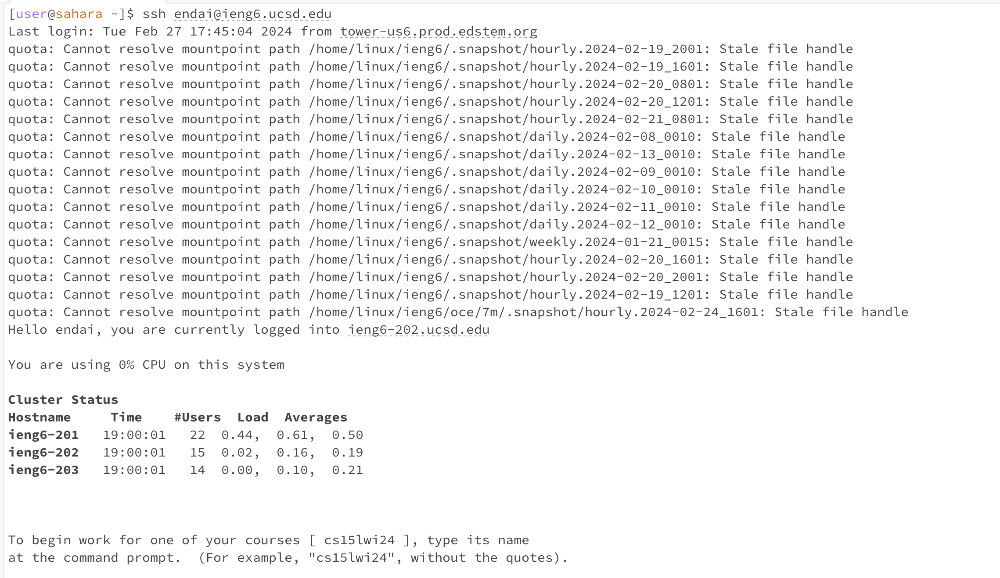
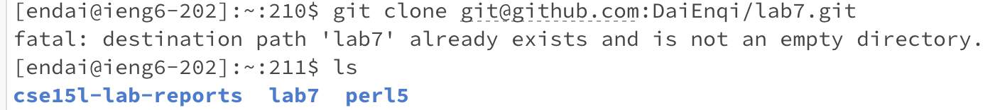
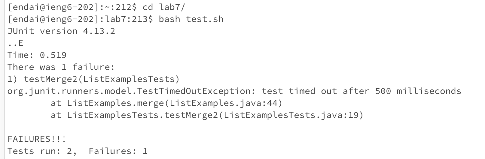
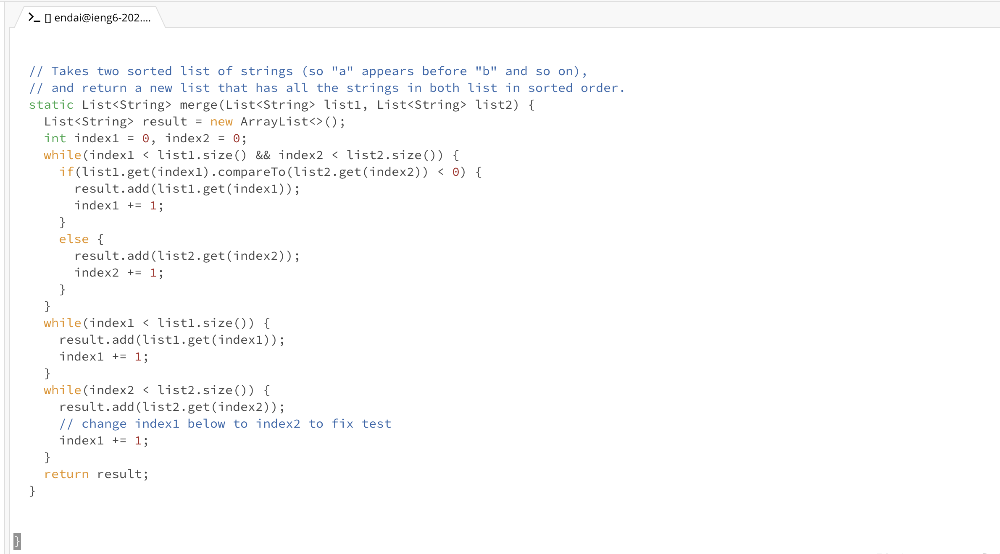
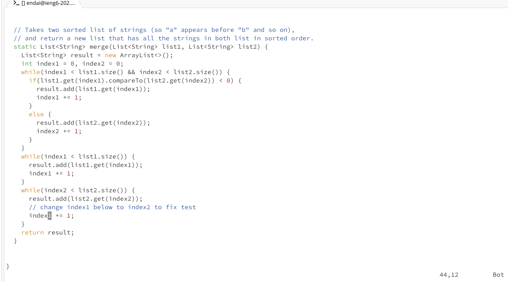
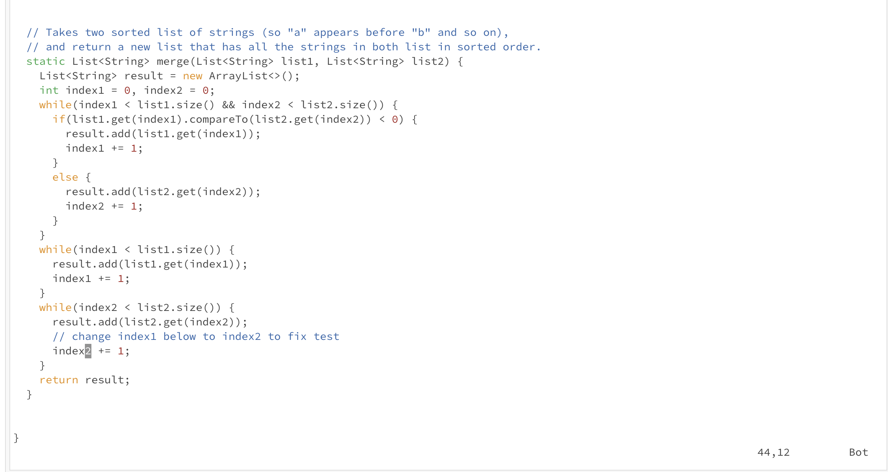
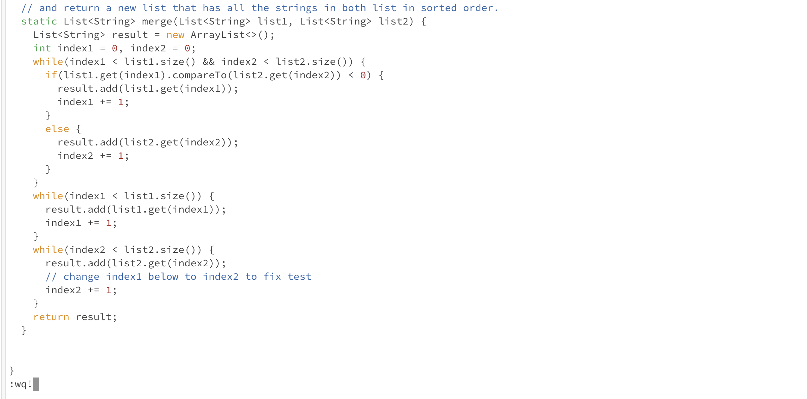
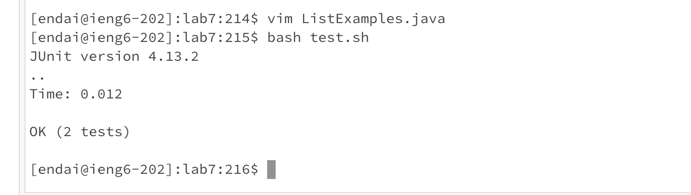
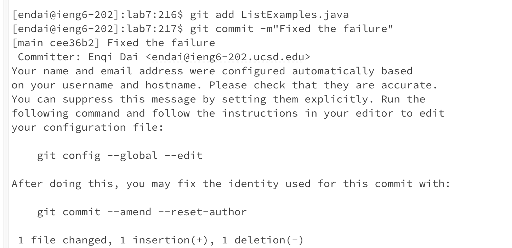
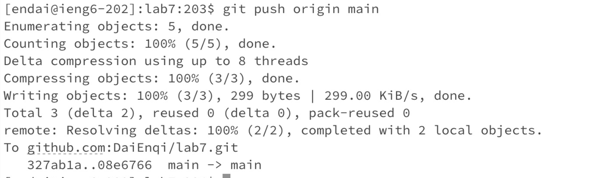

Step4: 

The key I pressed: 
```
ssh <space> endai@ieng6.ucsd.edu <enter>
```
Since I have generated SSH Keys for ieng6, I can set up to SSH without a password!

Step5:

The  key I pressed:
```
git <space> clone <space> <command+V> <enter>
ls <enter>
```
This step I clone my fork of the repository from my Github account (using the SSH URL). Since I have cloned the SSH URL before, it says the lab7 already exits. After the "ls" command, we can see the "lab7" directory which we'll cd into next step.

Step6:

The key I pressed:
```
cd <space> l <tab> <enter>
bash t <tab> <enter>
```
This step I first cd into the lab7 directory and then run the tests, demonstrating that they fail.

Step7:

This step I need to edit the code file to fix the failing test. So firstly I press the key:
```
vim <space> L <tab> .java <enter>
```
This helps me open the java file on terminal by using vim to edit.


The key: 
```
6ke
```
Since I notice the cursor is at the bottom of the page, I use the key to move it 6 lines up to get to the line I need to edit. And then use the key "e" to put the cursor at the end of the word "index1".


The key:
```
r2
```
I use the key to change the "1" to "2" which means the "index1" changed to "index2".


The key:
```
<esc> :wq! <enter>
```
By using this key, I save and exit the vim.

Step8:

The key:
```
bash <space> t <tab> <enter>
```
This step I run the tests again, demonstrating that they now succeed.

Step9:

The key:
```
git <space> add <space> L <tab> <enter>
git <space> commit <space> -m"Fixed <space> the <space> failure" <enter>
```
This step I commit and push the resulting change to my Github account. Firstly I add the updated file using git add and then commit it using git commit with the "Fixed the failure" message.


The key:
```
git <space> push <space> origin <space> main <enter>
```
The last step I push the resulting change to my Github account. Up to now my baseline time is about 3 minutes.
